# 🎓 Шаблон тезиса/статьи на LaTeX для СНТК (БГУИР)

В данной директории хранится шаблон для оформления тезиса/статьи для СНТК. 

## 📦 Структура проекта

- `conf.sty` — основной файл со стилем оформления (оформление заголовков, шрифт, отступы, оглавление и т.д.)
- `png/` — папка с изображениями, которые вставляются в документ
- `note/` — шаблон проекта
- `template.tex` файл — основной файл проекта

## 🛠 Установка и сборка

### ✅ Локально

Для компиляции шаблона локально вам потребуется LaTeX-дистрибутив:

- Windows: [MiKTeX](https://miktex.org/)
- macOS: [MacTeX](https://tug.org/mactex/) или (https://www.youtube.com/watch?v=CmagZthwhaY)
- Linux: `texlive-full` (или минимальный `texlive` + нужные пакеты)

Предлагается использовать следующую команду для компиляции проекта:

`pdflatex -shell-escape template.tex`

### ☁️ Через Overleaf

Шаблон можно собрать и в Overleaf. Однако обратите внимание:

- В бесплатной версии Overleaf действует **лимит времени компиляции**, поэтому при сборке большого проекта может возникнуть ошибка.
- Рекомендуется загружать проект в Overleaf через `.zip`, содержащий все `.tex`, `.sty`, `.pdf`, изображения и прочие ресурсы либо всю дирректорию.

---
### Работа с ☁️ Overleaf

- Перейти на сайт https://ru.overleaf.com/, далее рекомендуется войти через google.
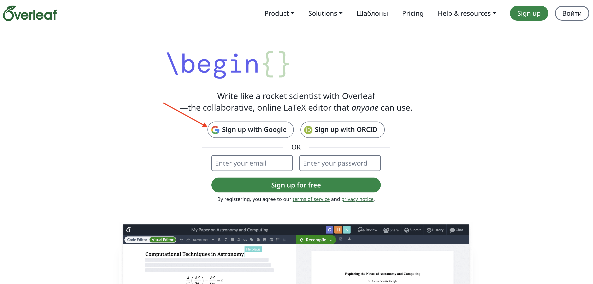

- Войти через google account.
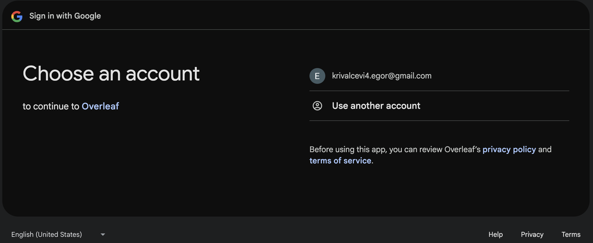

- Заполните информацию о себе.
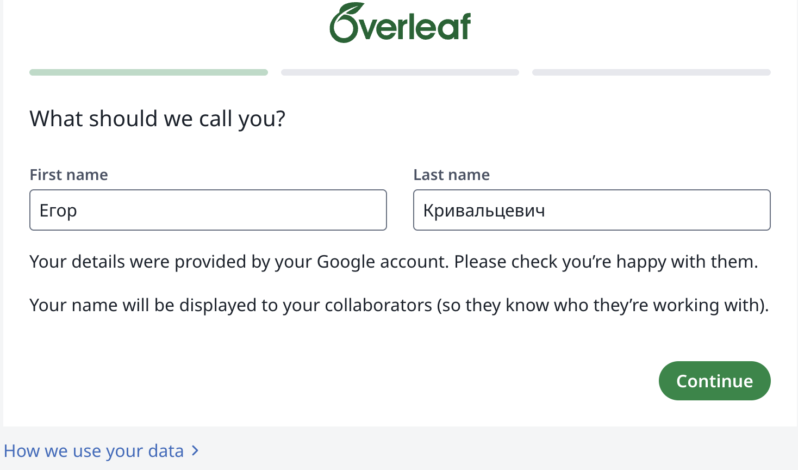

- Ответы на вопросы).
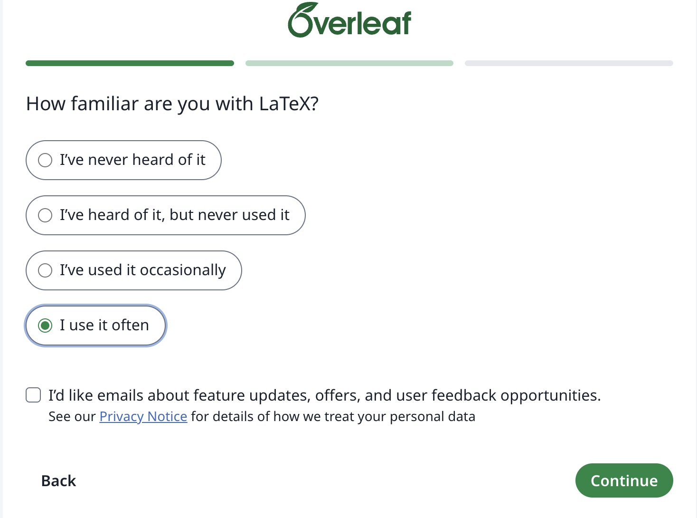

- Ещё немного информации...
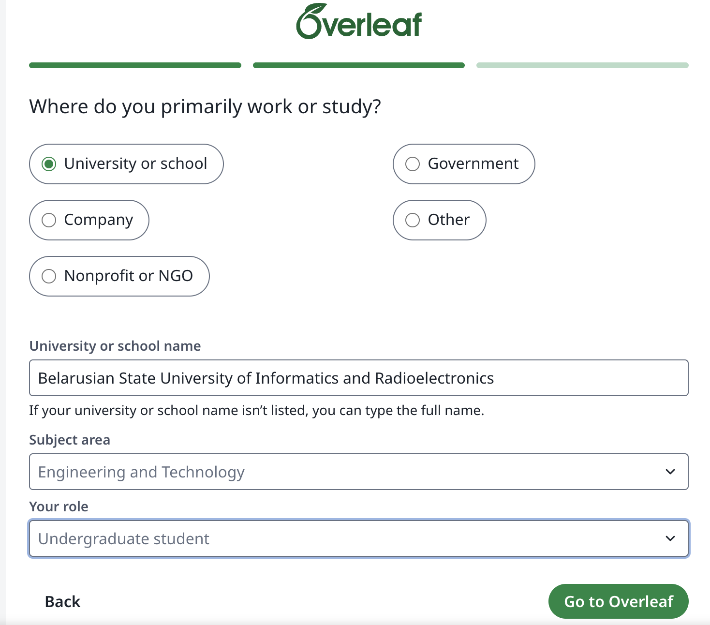

- Регистрация завершена успешно.
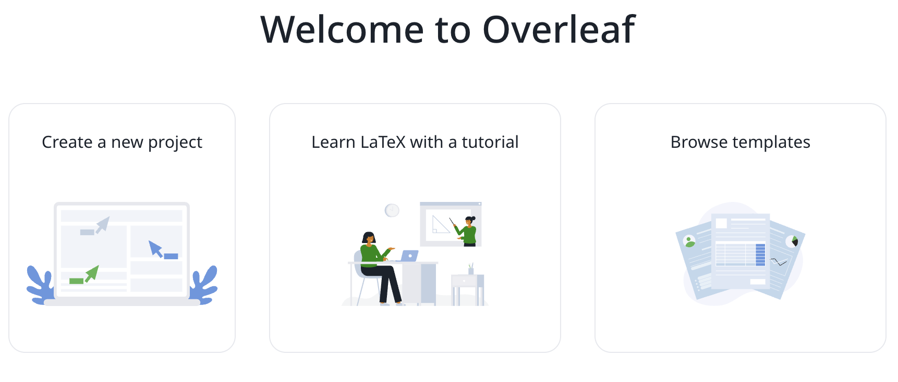

- Перейдем к добавлению шаблона. Склонируйте данный репозиторий.
git clone https://github.com/krivalcevich-egor/latex_bsuir.git

- В overleaf нажмите на  Create a new project и выберите upload project.
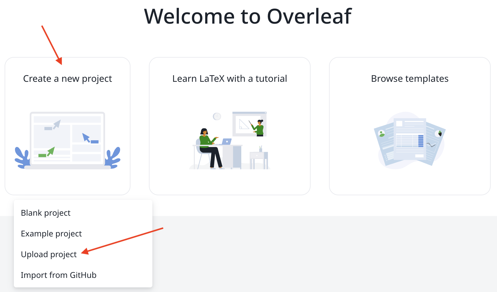

- Далее необходимо загрузить архив с шаблоном проекта.
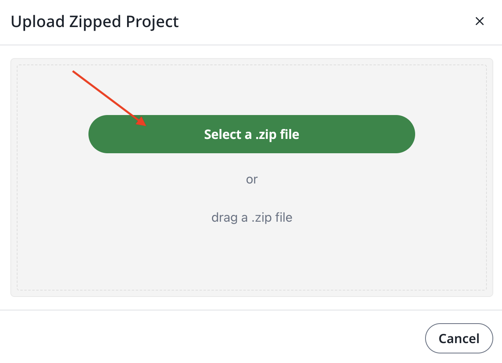

- Перейдите в дирректорию ./SNTK/ и выберите архив дирректории note. Затем нажмите open.
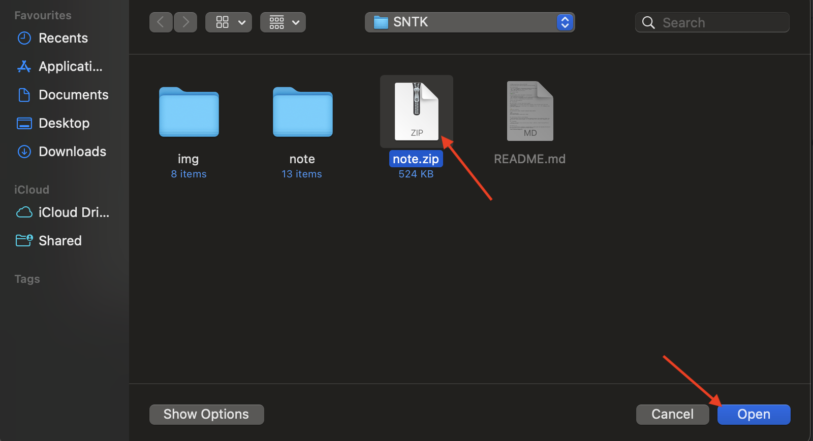

- Всё, вы успешно загрузили шаблон в overleaf, можно приступить к написанию статьи, следуя примерам и рекомендациям.
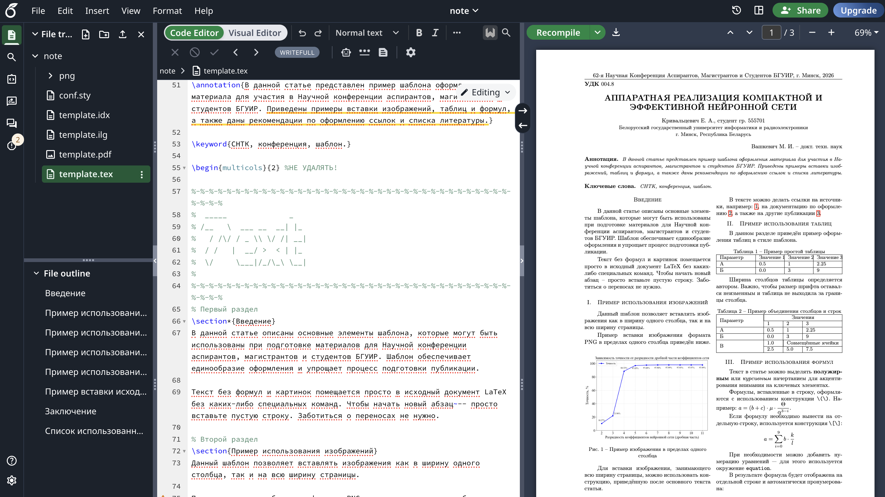

- Если вы хотите писать данную работу совместно, то нажмите на Share, далее введите email вашего коллеги, выберите роль(Editor, Reviewer или Viewer) и нажмите Invite.
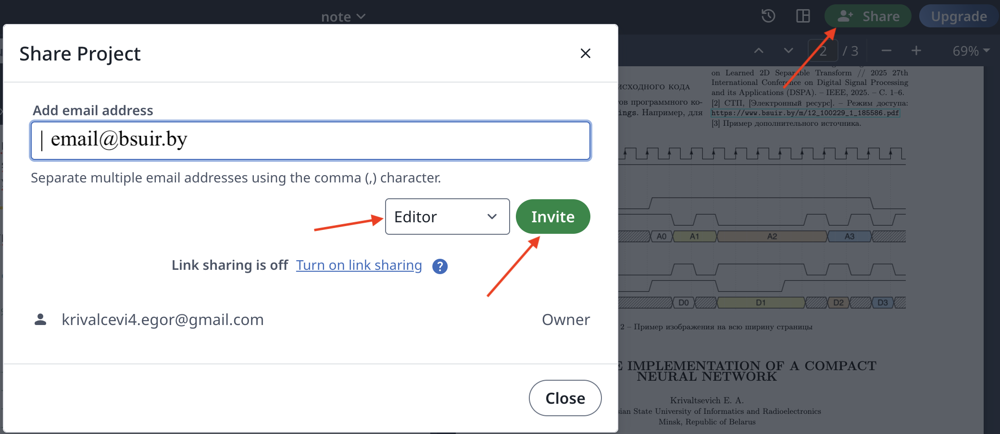

---

## 🖼 Вставка изображений

Для вставки рисунков в документ используются специальные команды из шаблона:

```latex
\image{
[width=7.8cm]{png/gr.png}
\caption{Пример изображения в пределах одного столбца}
}
```

### ⚙️ Дополнительные особенности вставки изображений

- **Ширина изображений**: для всех типов рисунков ширина изображения указывается в виде коэффициента от ширины текста или в конкретных единицах измерения (например, `cm`). Регулируя пораметр `width` можно вставить изображение на весь лист.

### 📝 Рекомендации

- **Таблицы**: рекомендуется, если не понятно как сделать таблицу, то обратиться к [онлайн конструкторам](https://www.tablesgenerator.com).

### 📬 Обратная связь

Если у вас возникли вопросы или предложения по улучшению шаблона, вы можете оставить свои комментарии или написать нам. Мы всегда рады помочь и учесть ваши пожелания для будущих обновлений.

Контактные данные для обратной связи:
- Email: krivalcevich4.egor@gmail.com
